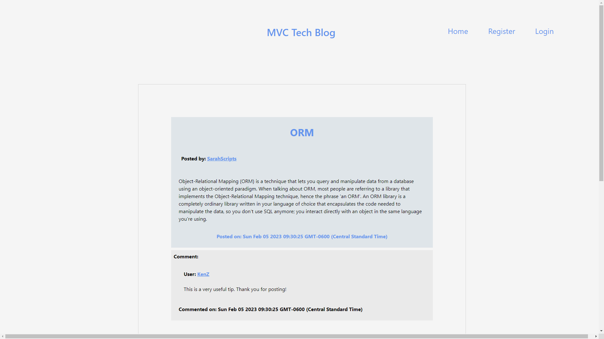

# MVC-Tech-Blog

A tech-blog website that allows users to create posts about web-development topics as well as comment on other users' posts.

# Database Seeding

Run 'npm run seed' to seed the database with some user data.

# Screenshot

# Future Development

Currently the login feature is not functioning properly, however a user is able to register and their account is stored in the database.
I intend on continuing to develop this project to allow users to login and comment on existing posts, as well as create their own.

Improvements in the UI are also a focus for future development.